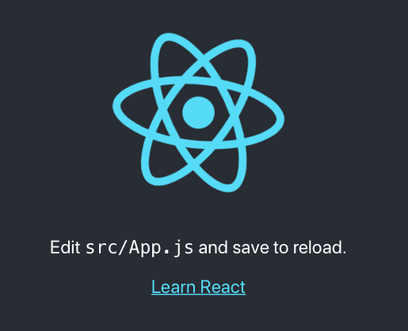
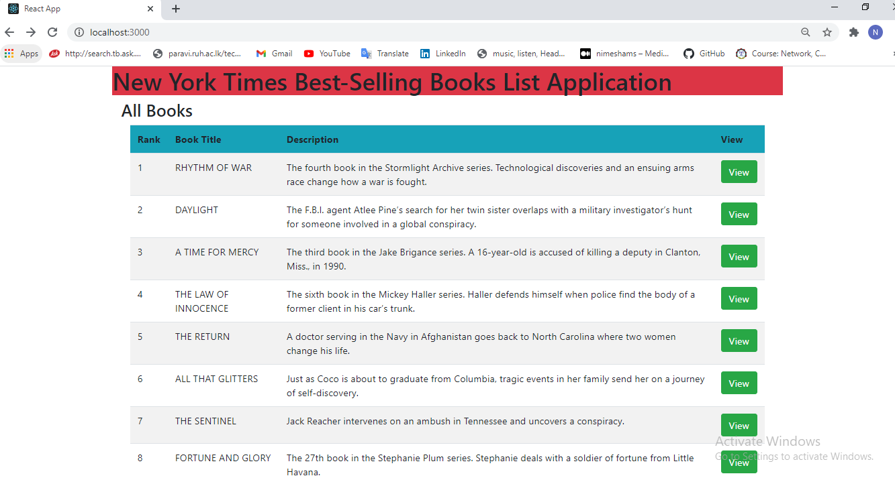
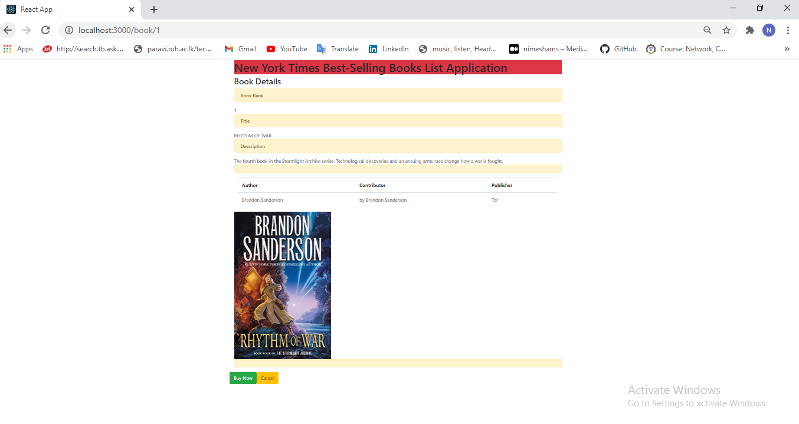

# NewYorkTimesBestSellingBooksProject
Prerequisites
	Node.js (and npm).
	Your favorite IDE (SublimeText, Visual Studio Code..etc)

Step 1: Procedure for Create React Application

	On a command line or command prompt, install the Create React App package.
	npm install -g create-react-app
	 
	Create a new React project named newyorktimes-bestselling-books.
	npx create-react-app newyorktimes-bestselling-books
	
	Change into the newly created directory.
	cd newyorktimes-bestselling-books
	
	Launching up React Frontend Application
	npm run start
	
When you launch up the application in the browser at http://localhost:3000/, you would see the welcome screen.
(React Simple UI)

Step 2: Creating React Frontend application and connect to backend API for Retrieve All best-selling books list.

We would want to start building the screens shown below:

(Book list screenshot)

(Book details screenshot)

	
	
	Adding Frameworks to React Application
	In this project, we will make use of axios to execute REST APIs and react-router-dom to do the Routing between pages. Let’s stop the front end app running in the command prompt and execute these commands.
	
	npm add axios
	npm add react-router-dom
	
	Let’s update the App.css to use Bootstrap framework:

	/src/App.css
	@import url(https://unpkg.com/bootstrap@4.1.0/dist/css/bootstrap.min.css)
	
	Creating a Home page, Here we added routing - NewYorkBestSellingBooksApp.js
	/src/component/NewYorkBestSellingBooksApp.js
	
	Creating a List Books Component
	Let’s create a new component for showing the List of books - BooksListComponent.js.

	/src/component/BooksListComponent.js
	
	Creating a Books Details Component
	Let’s create a new component for showing the Detais of book which selected from the table - BooksComponent.js

	/src/component/BooksComponent.js
	
	Create Service for Retrieve all book list
	Let’s create a new service for Retrieve all best-selling book list - BooksService.js
	
	/src/service/BooksService.js
	
	
Step 3: Launching up Final Application

	Run below command to Launching up React Frontend Application
	
	npm run start
	
	
	
	
	

	
	
	
